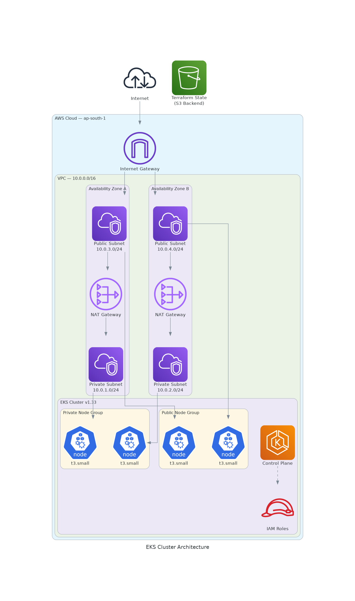

# Terraform EKS Cluster

Production-ready Amazon EKS cluster provisioned with Terraform. Includes a multi-AZ VPC, private/public node groups, IAM roles with least-privilege policies, NAT gateways, and Cluster Autoscaler support.


---

## Architecture



### What this provisions

| Resource | Details |
|---|---|
| VPC | 10.0.0.0/16, DNS support enabled |
| Subnets | 2 public + 2 private across 2 AZs |
| NAT Gateways | One per public subnet for private node outbound traffic |
| Internet Gateway | Public subnet internet access |
| EKS Cluster | v1.33, private + public endpoint, full control plane logging |
| Node Groups | Private (t3.small, 1–3) + Public (t3.small, 1–3) with Cluster Autoscaler labels |
| IAM Roles | Control plane + node group roles with least-privilege managed policies |
| Cluster Autoscaler | IAM policy attached to node group role |
| Security Groups | Control plane ↔ node bidirectional communication rules |
| S3 Backend | Remote state with versioning and public access block |

---

## Prerequisites

| Tool | Version |
|---|---|
| Terraform | >= 1.5 |
| AWS CLI | >= 2.x |
| kubectl | >= 1.33 |
| AWS account | With permissions to create EKS, VPC, and IAM resources |

---

## Usage

### 1. Create the S3 backend bucket

```bash
export AWS_PROFILE=your-profile
export REGION=ap-south-1
export BUCKET_NAME=your-unique-tfstate-bucket

aws s3api create-bucket \
  --bucket "$BUCKET_NAME" \
  --region "$REGION" \
  --create-bucket-configuration LocationConstraint="$REGION"

aws s3api put-bucket-versioning \
  --bucket "$BUCKET_NAME" \
  --versioning-configuration Status=Enabled

aws s3api put-public-access-block \
  --bucket "$BUCKET_NAME" \
  --public-access-block-configuration \
    "BlockPublicAcls=true,IgnorePublicAcls=true,BlockPublicPolicy=true,RestrictPublicBuckets=true"
```

### 2. Configure variables

```bash
cp terraform.tfvars.example terraform.tfvars
# Edit terraform.tfvars with your values
```

### 3. Deploy

```bash
export ENV=dev

terraform init \
  -backend-config="bucket=$BUCKET_NAME" \
  -backend-config="key=$ENV/terraform.tfstate" \
  -backend-config="region=$REGION"

terraform plan -out=cluster.tfplan
terraform apply cluster.tfplan
```

### 4. Configure kubectl

```bash
aws eks update-kubeconfig \
  --region ap-south-1 \
  --name $(terraform output -raw eks_cluster_name)

kubectl get nodes
```

### 5. Destroy

```bash
terraform destroy
```

---

## File structure

```
.
├── main.tf                   # Provider, backend, Terraform version constraints
├── variable.tf               # All input variables and subnet locals
├── cluster.tf                # EKS cluster and node groups
├── network.tf                # VPC, subnets, IGW, NAT gateways, route tables
├── iam.tf                    # IAM roles and policy attachments
├── security-group.tf         # Control plane and node security groups
├── output.tf                 # Cluster endpoint, name, VPC ID
├── terraform.tfvars.example  # Variable template — copy to terraform.tfvars
└── .github/
    └── workflows/
        └── terraform.yml     # CI: fmt check, validate, tflint, trivy scan
```

---

## CI Pipeline

Every push and pull request runs automatically:

| Job | Tool | What it checks |
|---|---|---|
| Format | `terraform fmt` | Code style consistency |
| Validate | `terraform validate` | Configuration correctness |
| Lint | TFLint | Best practices and deprecations |
| Security | Trivy | CRITICAL and HIGH misconfigurations |

---

## Cost estimate

Running in `ap-south-1` with default settings (on-demand, 2 nodes):

| Resource | Approx. monthly cost |
|---|---|
| EKS control plane | ~$73 |
| 2× NAT Gateways | ~$64 |
| 2× t3.small nodes | ~$28 |
| **Total** | **~$165/month** |

> To cut costs for non-production: use a single NAT gateway and switch node groups to spot instances.

---

## Security notes

- Set `internal_ip_range` to your IP (`x.x.x.x/32`) in production — `0.0.0.0/0` exposes the API server publicly.
- `terraform.tfvars` is gitignored. Never commit it.
- Add a DynamoDB lock table to the S3 backend for safe concurrent use in a team.
